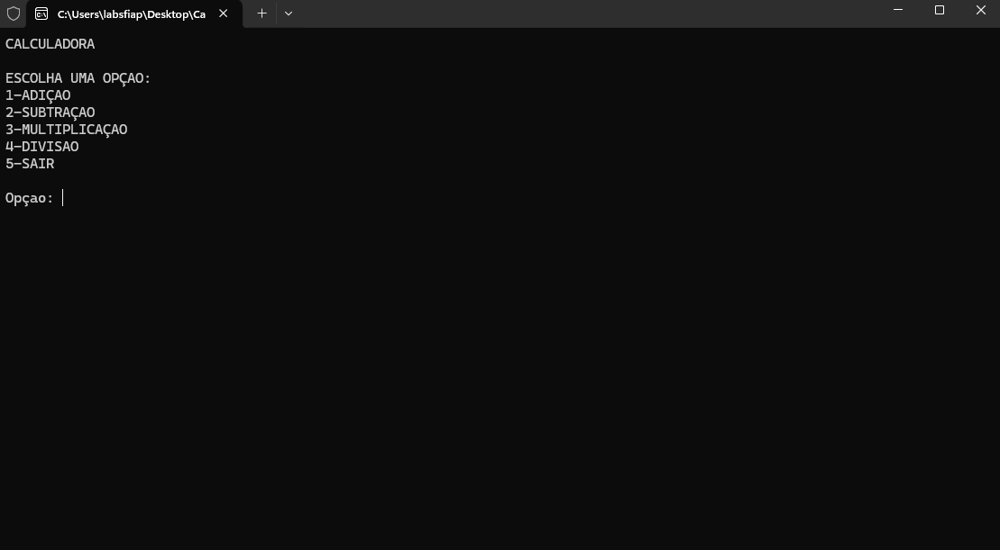
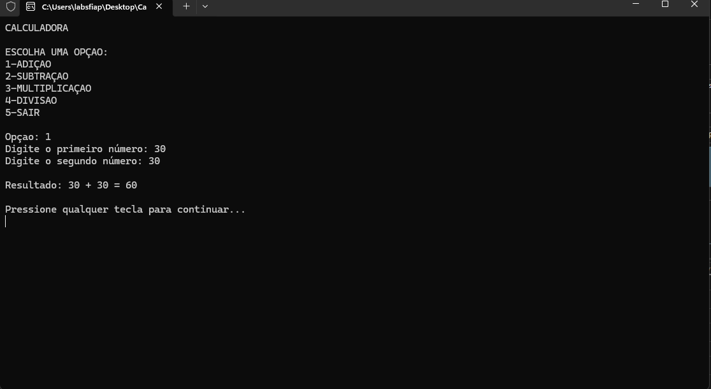
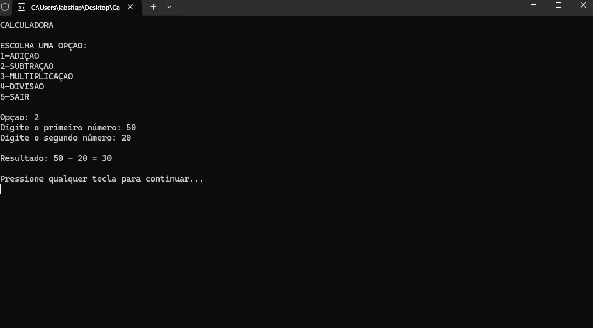
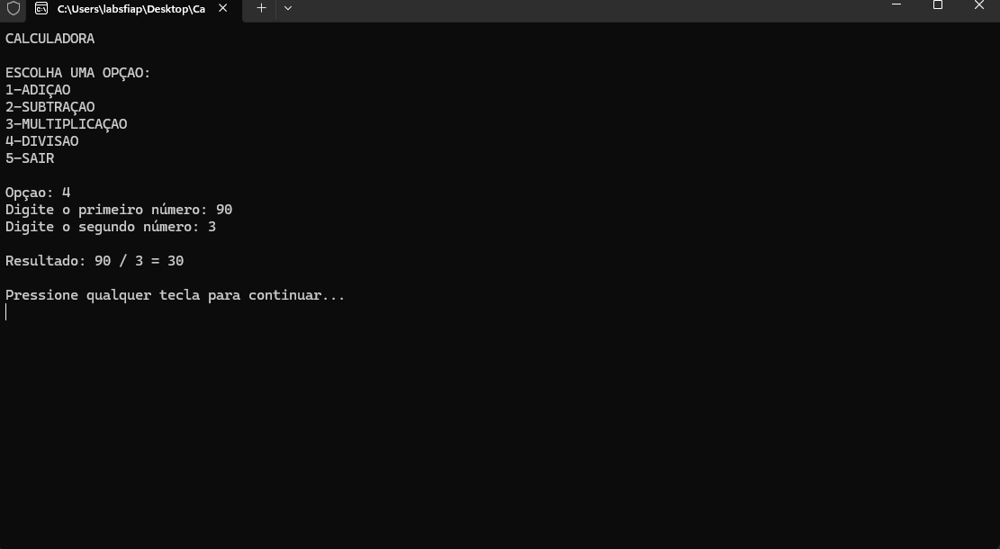

# Checkpoint 1 - Calculadora C#

Projeto desenvolvido para a disciplina de programação, consistindo em uma calculadora de console que realiza operações básicas.

## Integrantes

- Augusto Rocha Silva RM556316 

- Wendell Dos Santos Silva RM558859

- Guilherme Vieira RM557264

- Erik Yuuta Goto RM558076

## Menu Principal

O programa apresenta as opções de 1 a 5 para navegação do usuário.

## Evidências de Funcionamento

Abaixo estão os prints das operações realizadas:

1. Adição

2. Subtração

3. Multiplicação

4. Divisão

 
